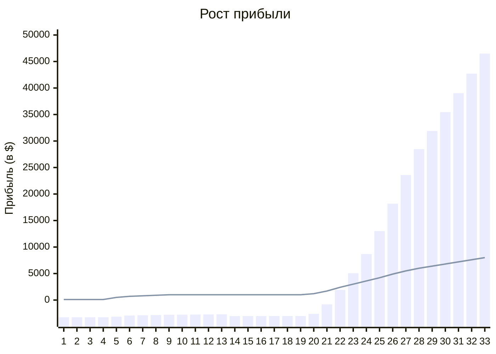

# Графики

```mermaid
xychart-beta
    title "Рост прибыли"
    x-axis [1, 2, 3, 4, 5, 6, 7, 8, 9, 10, 11, 12, 13, 14, 15, 16, 17, 18, 19, 20, 21, 22, 23, 24, 25, 26, 27, 28, 29, 30, 31, 32, 33]
    y-axis "Прибыль (в $)" -4000 --> 50000
    bar [-3242.5, -3242.275, -3242.05, -3241.825, -3133.8, -2915.0, -2867.55, -2819.45, -2770.7, -2749.875, -2729.05, -2708.225, -2687.4, -3025.575, -3022.75, -3019.925, -3017.1, -3014.275, -3011.45, -2598.625, -811.8, 1939.525, 5059.35, 8677.675, 13008.4, 18177.125, 23584.85, 28457.575, 31911.8, 35453.025, 39027.25, 42706.475, 46490.7]
    line [100, 100, 100, 100, 500, 700, 800, 900, 1000, 1000, 1000, 1000, 1000, 1000, 1000, 1000, 1000, 1000, 1000, 1200, 1700, 2400, 3000, 3600, 4200, 4900, 5500, 6000, 6400, 6800, 7200, 7600, 8000]
```
