```mermaid
xychart-beta
    title "Рост прибыли в зависимости от количества заведений"
    x-axis "Месяцы" [1, 2, 3, 4, 5, 6, 7, 8, 9, 10, 11, 12, 13, 14, 15, 16, 17, 18, 19, 20, 21, 22, 23, 24, 25, 26, 27, 28, 29, 30, 31, 32, 33]
    y-axis "Прибыль (в $)" -4000 --> 20000
    bar [-3242.5, -3242.275, -3242.05, -3241.825, -3133.8, -2915, -2867.55, -2819.45, -2770.7, -2749.875, -2729.05, -2708.225, -2687.4, -3025.575, -3022.75, -3019.925, -3017.1, -3014.275, -3011.45, -2598.625, -1516.8, 19.5249999999996, 1492.35, 3049.675, 4905.4, 7185.125, 9289.85, 11045.575, 12468.8, 13790.025, 15135.25, 16576.475, 18113.7]
    bar [-3242.5, -3242.275, -3242.05, -3241.825, -3133.8, -2915, -2867.55, -2819.45, -2770.7, -2749.875, -2729.05, -2708.225, -2687.4]
    line [100, 100, 100, 100, 500, 700, 800, 900, 1000, 1000, 1000, 1000, 1000, 1000, 1000, 1000, 1000, 1000, 1000, 1200, 1700, 2400, 3000, 3600, 4200, 4900, 5500, 6000, 6400, 6800, 7200, 7600, 8000]
```

import { Callout } from "nextra/components"

## Экономика

> Доказательство нашей эффективности

<Callout type="warning">
Главная проблема для Opia World сейчас - количество клиентов, которое мы не успеваем подключать к системе
</Callout>

*Отсутствие вложений в маркетинг и рекламу, органический рост и лиды - свидетельство того, что мы нашли свой Product market fit, и сейчас у нас появилась необходимость в автоматизации процессов подключения, новых кадрах и масштабировании на новые рынки.*

### Мы можем ускорить процесс

| Скорость подключения | <u>*1 заведение - 3 дня при условии полной интеграции;    1 заведение - 1 день при условии автономной работы;    10 заведений до 1.5 недель в рамках одной сети;    Как итог: 230 заведений в год* </u>|
| ----------- | ----------- |
| **Average revenue per est (Restaurant)** | <u>**_*35000$*_**</u> |
| **CAC** | <u>**_*460$ (Sales / Ads / Community / Органика)*_**</u>|
| **LTV (36m)** | <u>**_*7320$*_**</u> |
| **% of orders with OPIA system** | <u>**_*20%*_**</u> |

| | 2024 г. | 2025 г. | 2026 г. |
| ----------- | ----------- | ----------- | ----------- |
| **EBITDA** | -229,4K | 442,42K | 3,3M |
| **Revenue** | 125,9K | 1,8M | 5,9M | 

- Показатель **CAC** ниже, так как скорость подключения клиента и стоимость их подключения сокращается.
- **Увеличение конверсии** за счет повышения узнаваемости бренда, роста активных участников и работы с текущим комьюнити. Необходимо понимать, что этот показатель будет показывать органический рост от месяца к месяцу.
- **Скорость подключения клиента**. Мы уже значительно автоматизировали процесс запуска и [начали работы по масштабирванию](/scaling#как-мы-планируем-масштабироваться), однако планируем сосредоточить свое внимание на ускорении процесса интеграции с POS системами в случае, когда клиент выбирает этот кейс.
- **Есть желание ознакомиться с моделью и подробнее узнать о нас?** <u>*<a href="mailto:x5@opia-world.com">Напишите нам!</a>*</u>

<Callout type="default">
    Мы пониманием, за счет чего растут метрики нашего продукта, видим серьезный органический рост и интерес со стороны клиентов в сфере HoReCa, однако уже сегодня мы задумываемся о возможности выхода на другие регионы, планируем запускать новые проекты в рамках нашего сервиса, тем самым увеличивая собственные шансы и шансы наших партнеров на многократный экономический рост и узнаваемость экосистемы Opia World.
</Callout>

---

### Если оставить все, как есть
*В текущем CAC включены дополнительные затраты, связанные с разработкой качественного масштабируемого продукта*

| Скорость подключения | <u>*1 заведение - до 10 дней при условии полной интеграции;    1 заведение - 1 день при условии автономной работы;    10 заведений - 3 недели в рамках одной сети;    Как итог: в среднем до 100 заведений в год*</u> |
| ----------- | ----------- |
| **Average revenue per est (Restaurant)** | <u>**_*35000$*_**</u> |
| **CAC** | <u>**_*600$ (нет Sales Manager / нет вложений в маркетинг и рекламу. Только органика)*_**</u>|
| **LTV (36m)** | <u>**_*4200$*_**</u> |
| **% of orders with OPIA system** | <u>**_*15%*_**</u> |

<Callout type="default">
    И тем не менее будем экономически эффективны, так как выйдем на самоокупаемость за счет клиентов в листе ожидания, автоматизируем и ускорим процесс подключения клиентов (сделая его кратно меньше).
</Callout>