import { Callout } from "nextra/components"
import Image from 'next/image'

## Экономика

*Доказательство нашей эффективности* 👇

<Callout type="warning">
Главная проблема для Opia World на текущий момент - количество клиентов, которых мы не успеваем подключать к системе.
</Callout>

Отсутствие вложений в маркетинг и рекламу, органический рост и лиды, поток клиентов, который стремительно увеличивается за счет рекомендаций - свидетельство того, что мы нашли свой **Product market fit**, и сейчас у нас появилась необходимость в автоматизации процессов подключения и масштабировании. Именно поэтому на данном этапе нам не хватает ресурсов, чтобы искать и нанимать сотрудников, которые соответствуют уровню текущей команды.

### Самостоятельный путь: Раньше -> Сейчас -> Перспектива

<Image src="/graph.png" alt="Подключение клиентов" width={840} height={300} /> 

> На графике выделен тестовый период, период разработки продукта и период внедрения Opia Up для текущих клиентов исходя из наших мощностей, скорости интеграци и онбординга клиентов перед запуском.

  

<Image src="/table.png" alt="Подключение клиентов" width={840} height={300} /> 

### Перспективы на сегодняшний день

<Callout type="default">
    Мы будем экономически эффективны, так как выйдем на самоокупаемость за счет клиентов в листе ожидания, автоматизируем и ускорим процесс подключения клиентов (сделая его кратно меньше).

```mermaid
xychart-beta
    title "Рост прибыли в зависимости от количества заведений"
    x-axis "Месяцы" [1, 2, 3, 4, 5, 6, 7, 8, 9, 10, 11, 12, 13, 14, 15, 16, 17, 18, 19, 20, 21, 22, 23, 24, 25, 26, 27, 28, 29, 30, 31, 32, 33]
    y-axis "Прибыль (в $)" -4000 --> 20000
    bar [-3242.5, -3242.275, -3242.05, -3241.825, -3133.8, -2915, -2867.55, -2819.45, -2770.7, -2749.875, -2729.05, -2708.225, -2687.4, -3025.575, -3022.75, -3019.925, -3017.1, -3014.275, -3011.45, -2598.625, -1516.8, 19.5249999999996, 1492.35, 3049.675, 4905.4, 7185.125, 9289.85, 11045.575, 12468.8, 13790.025, 15135.25, 16576.475, 18113.7]
    bar [-3242.5, -3242.275, -3242.05, -3241.825, -3133.8, -2915, -2867.55, -2819.45, -2770.7, -2749.875, -2729.05, -2708.225, -2687.4]
    line [100, 100, 100, 100, 500, 700, 800, 900, 1000, 1000, 1000, 1000, 1000, 1000, 1000, 1000, 1000, 1000, 1000, 1200, 1700, 2400, 3000, 3600, 4200, 4900, 5500, 6000, 6400, 6800, 7200, 7600, 8000]
```

</Callout>

> График согласно нашей модели монетизации и скорости подключения без дополнительных вложений. Все текущие клиенты уже согласовали условия сотрудничества и находятся в ожидании подключения. *Главная проблема - ограниченность ресурсов, которая влияет на скорость подключения.*

### Ускорение процесса путем привлечения инвестиций

<Image src="/connect.png" alt="Подключение клиентов" width={840} height={300} /> 

    
Подробнее

    - **Кратно увеличить количество клиентов** за счет дополнительных продаж, возможности ускорения процесса подключение и интеграции в 3,5 - 4 раза. Тестирование новых способов продаж и донесение ценности до потенциальных клиентов. 
    - **Сократить скорость подключения клиента** за счет дополнительных часов разработки и обучения (интеграция с POS). Мы пониманием, что нам нужно делать и в какой момент времени.
    - **Увеличить конверсию клиентов, которые выберут Opia** за счет повышения узнаваемости бренда, роста активных участников и работы с текущим комьюнити. Данный показатель уже показывает стремительный органический рост от месяца к месяцу.
    - **Масштабировать продукт на другие рынки**. Проделанная работа с интеграциями в POS значительно ускорит этот процесс. Все текущие POS-системы в мире глобально ничем не отличаются либо являются дочерними компаниями тех систем, с которыми мы уже взаимодействуем.

### Итог

Мы значительно автоматизировали процесс запуска и [начала работ](/scaling#как-мы-планируем-масштабироваться), однако планируем сосредоточить свое внимание на ускорении процесса интеграции с POS-системами в случае, когда клиент выбирает этот кейс.

**Есть желание ознакомиться с моделью и подробнее узнать о нас?** <i><u><a href="mailto:x5@opia-world.com">Напишите нам</a></u></i>

<Callout type="default">
    Мы пониманием, за счет чего растут метрики нашего продукта, видим органический рост и интерес со стороны клиентов в сфере HoReCa, однако уже сегодня мы задумываемся о возможности выхода на другие регионы, планируем запускать новые проекты в рамках нашего сервиса, тем самым увеличивая собственные шансы и шансы наших партнеров на многократный экономический рост и узнаваемость экосистемы Opia World.
</Callout>
