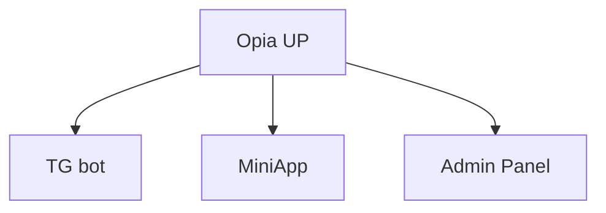
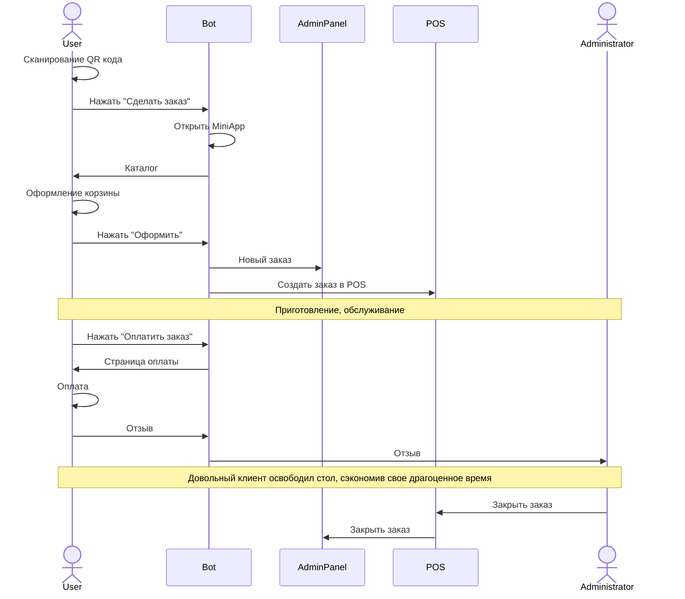
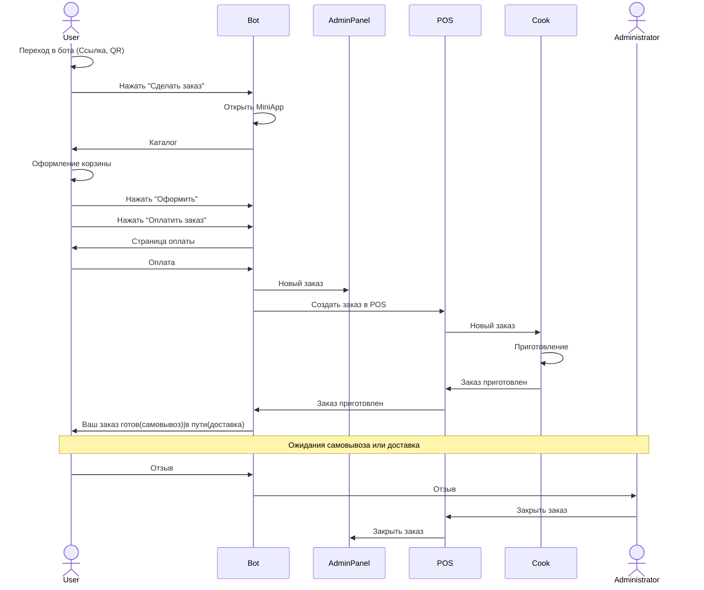

import Image from 'next/image'
import { Bleed } from 'nextra-theme-docs'
import { Callout } from "nextra/components"
import { Cards, Card } from "nextra/components"

## Продукты OPIA WORLD

<Image src="/tg-products.jpg" alt="Продукты Телеграма" width={840} height={300} /> 

### Opia UP

<Callout type="info">Неограниченный маркетлейс в Телеграм</Callout>

    
Описание

    Мини-приложение для пользователей внутри мессенджера Telegram, которое представляет собой food-маркетплейс с возможностью формирования заказов, предварительной оплаты и постоплаты, бронирования столов и еды в любом из существующих кейсов сферы HoReCa.
    
    🍽️ Столы — заказ за столами путем сканирования QR-кодов или NFC-меток, связанных с конкретным столом.
    
    🍔 Фастфуд — заказ без очереди путем сканирования кода или использования мини-приложения для выбора заведения.
    
    🏬🍴 Фуд-корт — заказ путем сканирования кода и выбора конкретного заведения в определенной локации в mini app.
    
    🚚 Доставка - дистанционный заказ с доставкой из любой удаленной точки, выбрав конкретное заведение в mini app или отсканировав QR-код.
    
    🛍️ Самовывоз - дистанционный заказ на самовывоз из выбранного места.

|  TG bot | MiniApp |
|---|---|
| <video height="300" width="350" controls> <source src="/bot.mp4" /> Your browser does not support the video tag... </video> | <video height="300" width="350" controls> <source src="/miniapp.mp4" /> Your browser does not support the video tag... </video> |

##### Кейс "Столики"

<Callout type="info">Оффлайн и онлайн оплата</Callout>

- Заказы и дозаказы без ожиданий.
- Онлайн оплата заказа в любой момент времени.
- Мультиязычность в зависимости от языка мессенджера пользователя.
- Никаких личных данных и регистраций.
- Возможность вызова официанта для оплаты оффлайн.

    
Схема кейса

##### Кейс "Доставка/Самовывоз"

- Не нужно устанавливать приложение.
- Не нужно вводить личные данные, чтобы начать пользоваться.
- Все заведения в мессенджере.
- Мультиязычность в зависимости от языка мессенджера пользователя.
- Средняя скорость доставки минимум на 2 минуты быстрее, чем в любом доступном фуд-маркетплейсе.
- Контроль статусов заказа.

    
Схема кейса

### Opia Invoice

<Callout type="info">Моментальные платежи в Telegram. Один Bot-менеджер для быстрого выставления счетов в Telegram</Callout>

- Возможность оформить и оплатить заказ не выходя из беседы / чата / группы.
- Моментальное выставление (5 секунд - среднее время выставления счета).
- Автоматизированный процесс сбора данных о заказах за любой период.
- Только Telegram.

<video controls> <source src="/invoice.mp4" /> Your browser does not support the video tag... </video>

    
Схема Opia Invoice

    <Image src="/invoice.png" alt="Схема Opia Invoice" width={840} height={300} /> 

Подробнее про кейсы и метрики 👇

<Cards>
  <Card title="Кейсы и метрики" href="cases_and_metrics" />
</Cards>
